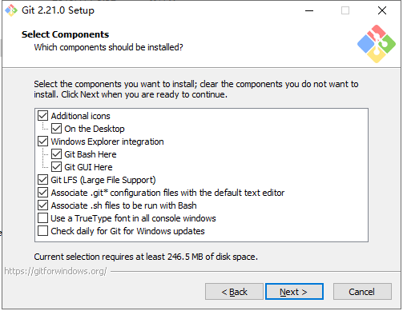
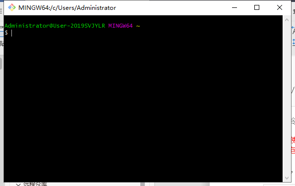

### GIT基本操作

* [Git 下载]<https://git-scm.com/>

* 

* 

* 一直点击`next`按钮，最后点击install按钮。等待安装完成。

* 安装完成后显示：

* 

* 在黑色命令行中配置Git：

  * 输入用户名：git config --global user.name "your name"

  * 输入邮箱账号：git config --global user.email "email@example.com"

  * 在自己电脑上创建一个项目文件夹：

    * 进入E盘：cd  /e

      `cd 可以将当前目录切换到指定的文件夹下，在linux的命令行中没有盘符的概念。`

    * 创建仓库文件夹：mkdir JavascriptStudy

    * 克隆远程版本库：git clone https://gitee.com/isbaina/Qianfeng.git

* 本地创建分支：

  * git branch dev `dev是一个分支名称，可以是任意名称。但是我们必须使用自己的名字的拼音加上座位号 `
  * git checkout dev `切换到自己的分支上提交作业`

* 向远程库推送内容：

  * 添加远程资源链接：git remote add origin https://gitee.com/isbaina/Qianfeng.git
  * 从远程库中拉取分支内容到自己电脑上：git pull origin dev
  * 向远程库中推送自己电脑上的分支内容：git push -u origin dev
