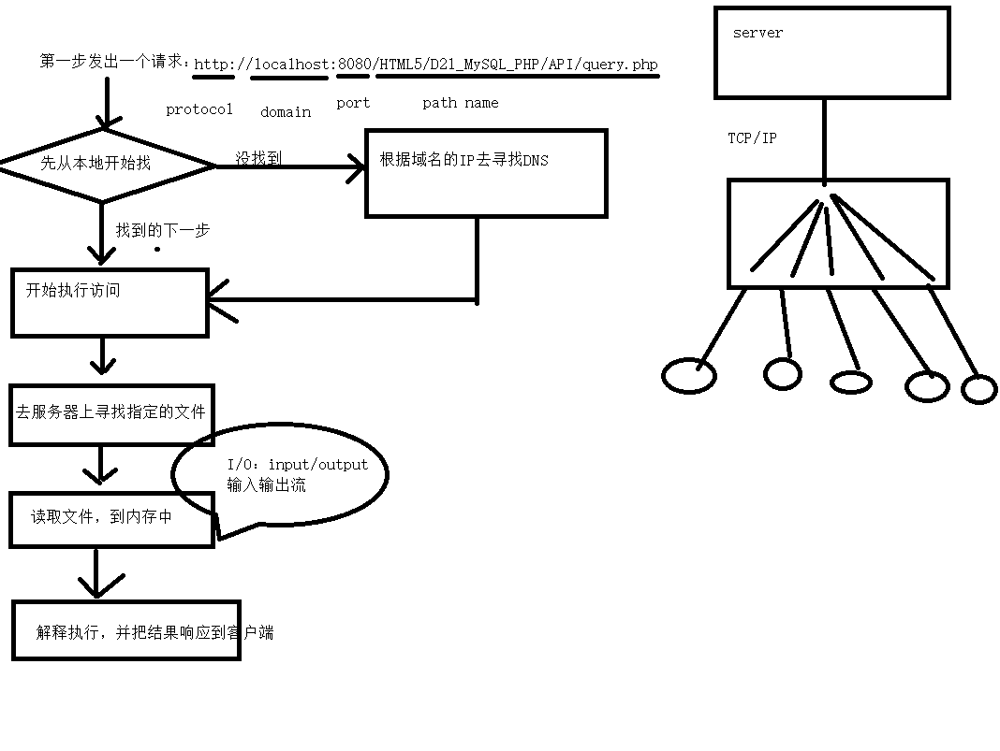

#### 主要任务与目的
* 学习Nodejs简介及COMMONJS模块化规范 学习npm , nrm 工具使用
* 学习nodemon 测试工具使用
* 学习内置模块 http , fs , path根据需求进行讲解
* 学会查阅文档
---
#### 安装NodeJS环境
* [NodeJS下载](http://nodejs.cn/download/)
---
#### NodeJS
* 运行在服务器端的JS环境，所以JS也变成了服务器端语言。
___
#### 客户端向服务器发出请求的过程都发生什么
* 验证请求的URL：http://localhost:8080/HTML5/D21_MySQL_PHP/API/query.php
* 域名是指向应用程序（域名就是指向某个具体的人的姓名一样）
* 端口相当于一扇门
;
* 根据客户端请求的URL->硬盘上找
	* 找不到：404
	* 找到->读取文件->响应到客户端->浏览器渲染HTML页面。
* 结束请求。
---
#### 什么是nodejs
* NodeJS 是一个基于 Chrome V8 引擎的 JavaScript 运行环境.
* NodeJS 是在服务端运行JS的一个平台或者说是环境
* 前端工程化环境构建一般也都是基于NodeJS的，非常方便好用
    * 为什么要基于Nodejs，是因为js本身没有I/O功能。
        * I/O可以对各种的类型的文件进行读写改删查。
    * JavaScript可以调用c模块；
---
#### JS模块化的规范有哪些
* NodeJS遵循的是COMMONJS规范
    * 因为服务器端执行的js文件，是没有网络传输过程的。所以希望的一个一个文件，通过require方式引入关联类。
    * 该规范至少目前来讲不适合前端开发。
* AMD 异步模块化规范
    * 代表有RequireJS（也就是requirejs是AMD一个实现）
    * 可以异步加载JS文件，按照模块加载方法，通过define()函数定义，第一个参数是一个数组，里面定义一些需要依赖的包，第二个参数是一个回调函数，通过变量来引用模块里面的方法，最后通过return来输出。
```javascript
// 是一个依赖前置、异步定义的AMD框架（在参数里面引入js文件），
// 在定义的同时如果需要用到别的模块，在最前面定义好即在参数数组里面进行引入，
// 在回调里面加载
define(['./a', './b'], function(a, b) { // 依赖在刚开始的时候定义
     a.doSomething();
     b.doSomething();
 });
```
* CMD 同步模块化规范，也叫通用模块化规范
    * 代表有SeaJS
```javascript
// 是SeaJS在推广过程中对模块定义的规范化产出，
// 是一个同步模块定义，是SeaJS的一个标准，
// SeaJS是CMD概念的一个实现，
// SeaJS是淘宝团队提供的一个模块开发的js框架.
define(function(require, exports, module) {
     var a = require('./a'); // 依赖在使用的时候引入
     a.doSomething();
     var b = require('./b') ;
     b.doSomething() ;
 });
```
---
#### 什么是CommonJS
* CommonJS是一种编程规范。建议js一个接口或者一个类为一个文件。
    * 真正的前端开发不能遵循CommonJS的规范，
    * 如果前端开发工作过程中使用CommonJS的规范，发布项目时可以借助工程化构建工具来合并压缩。
---
#### 服务器端nodejs环境的搭建
* 下载nodejs:[https://nodejs.org/en/]=>安装nodejs
---
#### NodeJS在前端开发中协助工程化工具一起使用
* [npmjs.com](https://www.npmjs.com/);
* 1.npm:node package manager工具的使用
    * 1.1.npm install [-g] packagename：全局安装和当前项目下安装
    * 1.2.npm uninstall packagename
    * 1.3.npm [-g] ls /node_modules/ 目录下列表
    * 1.4.npm update packagename 更新模块
    * 1.5.npm search packagename 搜索模块
    * 1.6.npm init 创建模块
    * 1.7.npm publish 发布模块

* 2.nrm:node response manager工具的使用主要作用：改变npm链路或者叫链接指向
    * 2.1.npm install -g nrm 全局安装nrm，nrm主要功能就是修改npm下载包时的镜像
    * 2.2.nrm ls 显示npm可以使用的下载包的地址
    * 2.3.nrm use taobao 将链路切换到taobao上

* 3.nodemon:热启动工具，不需要重新启动nodejs的工具
    * nodemon **.js
---
#### js 在命令行中运行
* 启动node命令行
---
#### js是如何在服务器端运行，充当服务器角色？
* nodejs是集成google V8引擎的，我们使用的google浏览器内部也是v8的引擎。
---
#### js在浏览器端的案例实现一个服务器端的路由
* 1.http模块
    * 可以创建服务器上的http链接。创建成功以后就可以提供给广大的用户访问。
* 2.fs模块
    * 主要用于读取文件
    * 另外还可以写入文件
        * 写文件时需要注意脏读，也就是数据不同步的问题。如张三，先打开文件写了一行内容后，还没有保存，然后李四又打开了该文件，又写入了一部分内容，保存了。此时张三还没有完成，过了一段时间后张三也保存了，会覆盖李四的内容。
        * 解决此问题，需要同步锁。或者文件追加等操作。比较繁琐。
```javascript
const _http=require("http");//模块化加载
_http.createServer(listener).listen(8081,log);//创建服务，并实现监听端口。


function listener(_request,_response){
    
}
function log(){//该方法一般用于服务器启动时输出日志
    console.log("success");
}
```

